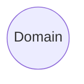
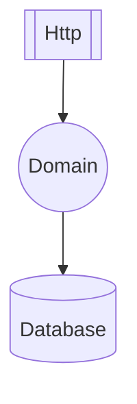
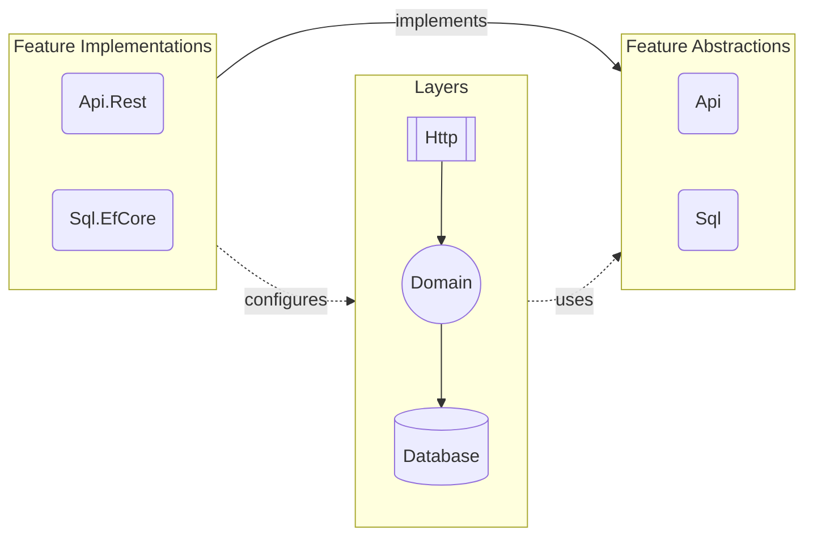

# Architecture

DO is designed to have a simple feature and layer system that enables us to
create software with any architectural style. Core idea is to have good
separation of concerns without causing any repetitive work. To achieve this we
need to break down an application into its individual components.

## Domain

At the core of an application lies its domain logic. By this we understand the
very reason for an application to exist. Everything else exists only to expose
this domain to outside world. So first part is the domain layer.

This layer contains all of the business code of your application. Now we have a
basic definition of what a domain is, but we need to clarify what a layer is.

## Layer

Each layer in DO introduces a new technology, such as a database server, web
server or a framework, to your application architecture. These layers are named
after their concept or protocol it introduces.

For example, `Do.Http` introduces _HTTP_ protocol as a layer through the
`ASP.NET Core` framework. Also, `Do.Database` introduces _ORM_ concept as a
layer through the `EF Core` framework.

But your domain objects would not just be exposed as API endpoints and mapped
onto a relational database. For that, we need to be able to configure those
layers so that they know how to interpret your domain objects.

This is why every layer comes with its own configuration API that is spesific
to the technology it uses. This API may contain a bunch of helper classes
and/or façade methods that makes it easy to build a certain type of
configuration, but they do __not__ have opinions upfront.

Another perspective to define whether a component is a layer or not is that, if
it introduces an internal system component like a database, message queue
server, web server, a framework; then it is a layer. If it is a cloud service
that your software depends on, then it should __not__ be a layer. External
system components are defined as feature implementations (adapters) which we'll
cover in the next section.

## Feature

A feature is an ability for a domain logic to use in order to access other
software components. Different domains require different types of abilities.
Every feature consists of two parts; abstraction (port) and implementation
(adapter).

A feature can have only one abstraction, but it can have more than one
implementations.

For example, `Do.Fs` represents file system feature that provides an API to
your domain logic to read/write files. `Do.Fs.Local` and `Do.Fs.AwsS3` are to
different implementations that provides the same functionality through
different system components.

Features are named after the ability they introduce. Proper names are `Do.Fs`,
`Do.Sql`, `Do.Nosql`, `Do.Logging`, `Do.Auth` etc.

So with the features a sample architecture looks like this;

### Abstraction

Abstraction library contains all common classes, interfaces, attributes for a
feature. It is the only accessible part of a feature from the domain layer.

### Implementation

- Feature Impl may depend on layer(s) and other feature.abstraction(s) as well
  as its own feature.abstraction (Adapter)
  - a feature implementation would require a layer, or a feature strictly
  - or it might optionally use a layer or a feature and works well without them
    as well
  - a feature implementation is named after its design or technology e.g.
    Do.Auth.Auth0, Do.Fs.Aws, Do.Sql.EfCore?, Do.PubSub.RabbitMq?
  - might introduce an external system component like auth0, keycloak, aws s3
    etc.
