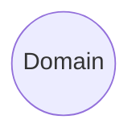
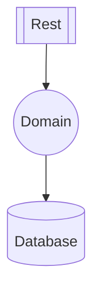

# Architecture

DO is designed to have a simple feature and layer system that enables us to
create software with any architectural style. Core idea is to have good
separation of concerns without causing any repetitive work. To achieve this we
need to break down an application into its individual components.

## Domain

At the core of an application lies its domain logic. By this we understand the
very reason for this application to exist. Everything else exists only to
expose this domain to outside world. So first part is the domain layer.

This layer contains all of the business code of your application. Now we have a
basic definition of what a domain is, but we need to clarify what a layer is.

## Layer

Each layer in DO introduces a new technology, such as a database server, web
server or a framework, to your application architecture. These layers are named
after their concept or protocol it introduces.

For example, `Do.Rest` introduces _RESTful API_ concept as a layer through the
`ASP.NET Core` framework. Also, `Do.Database` introduces _ORM_ concept as a
layer through the `EF Core` framework.

But your domain objects would not just be exposed as API endpoints and mapped
onto a relational database. For that, we need to be able to configure those
layers so that they know how to interpret your domain objects.

- Layer exposes corresponding tech and configurators
  - layer is named after its concept/protocol e.g. Do.Database, Do.Messaging,
    Do.Rest, Do.Grpc, Do.Monitoring, Do.IoC
  - not opinionated, but still provides configuration helpers and stuff
  - might introduce its own configuration classes
  - might introduce its own worker classes as well
  - introduces one internal system component like RDBMS, DocumentDB, MQ, HTTP
    Server etc.
    - do not create a layer for external system components like AWS S3

## Feature

Different domains require different types of abilities so that they can achieve
what they need to do. We call these abilities as features. Every feature has a
common interface (port) and implementation (adapter) part.

### Abstraction (Port)

- Feature Spec exposes interfaces, primitives and default classes (Ports)
  - feature.abstraction is named with the feature name only e.g. Do.Auth,
    Do.Sql, Do.Nosql, Do.Fs, Do.Log, Do.PubSub etc.

### Implementation (Adapter)

- Feature Impl depends on layer(s) and other feature.abstraction(s)
  as well as its own feature.abstraction (Adapter)
  - a feature implementation would require a layer, or a feature strictly
  - or it might optionally use a layer or a feature and works well without them
    as well
  - a feature implementation is named after its design or technology e.g.
    Do.Auth.Auth0, Do.Fs.Aws, Do.Sql.EfCore?, Do.PubSub.RabbitMq?
  - might introduce an external system component like auth0, keycloak, aws s3
    etc.
