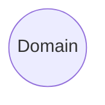
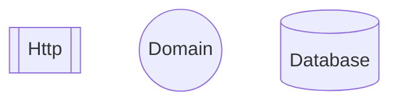
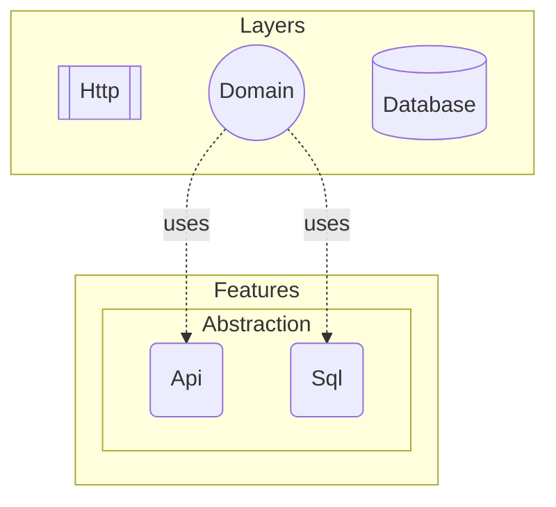
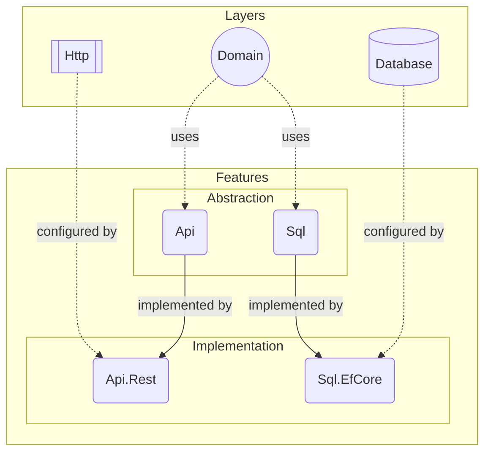

# Architecture

DO is designed to have a simple feature and layer system that enables us to
create software with any architectural style. Core idea is to have good
separation of concerns without causing any repetitive work. To achieve this we
need to break down an application into its individual components.

## Domain

At the core of an application lies its domain logic. By this we understand the
very reason for an application to exist. Everything else exists only to expose
this domain to outside world. So first part is the domain layer.

This layer contains all of the business code of your application. Now we have a
basic definition of what a domain is, but we need to clarify what a layer is.

## Layer

Each layer in DO introduces a new technology, such as a database server, web
server or a framework, into your application architecture. These layers are
named after their concept or protocol they introduce.

> :bulb:
>
> For example, `Do.Http` introduces _HTTP_ protocol as a layer through the
> `ASP.NET Core` framework. Also, `Do.Database` introduces _ORM_ concept as a
> layer through the `EF Core` framework.

But your domain objects would not just be exposed as API endpoints and mapped
onto a relational database. For that, we need to be able to configure those
layers so that they know how to interpret your domain objects.

This is why every layer comes with its own configuration API that is specific
to the technology it uses. This API may contain a bunch of helper classes
and/or façade methods that makes it easy to build a certain type of
configuration, but they do __not__ have opinions upfront.

> :information_source:
>
> Another perspective to define whether a component is a layer or not is that;
>
> If it introduces an internal system component like a database, message queue
> server, web server, a framework; then it __is__ a layer.
>
> If it is a cloud service that your software depends on, then it should
> __not__ be a layer. External system components are defined as feature
> implementations (adapters) which we'll cover in the next section.

## Feature

A feature is an ability for a domain logic to use in order to access other
software components. Different domains require different types of abilities.
Every feature consists of two parts; abstraction (port) and implementation
(adapter).

### Abstraction

An abstraction is the library that contains all common classes, interfaces,
attributes, if any, for a feature. It is the only accessible part of a feature
from the domain layer or from other feature implementations.

> :information_source:
>
> Each feature has only one abstraction, named after the ability it introduces,
> e.g. `Do.Fs`, `Do.Sql`, `Do.Nosql`, `Do.Logging`, `Do.Auth` etc.

### Implementation

This is the implementation part of a feature that provides concrete
implementations for the interfaces defined in the abstraction, along with
opinionated configurations using the configuration API of the corresponding
layer.

> :information_source:
>
> A feature may configure multiple layers to achieve its functionality.

Features may have multiple implementations, each named after its corresponding
design or technology, e.g. `Do.Api.Rest`, `Do.Auth.Auth0`, `Do.Fs.Aws`,
`Do.Sql.EfCore`.

> :bulb:
>
> `Do.Fs` represents file system feature that provides an API to your domain
> logic to read/write files. `Do.Fs.Local` and `Do.Fs.AwsS3` are two different
> implementations that provides the same functionality through different system
> components.

A feature may depend on a layer, or another feature, strictly. In this case, an
application will be required to include dependent features and layers for
depending feature to be used. Most of the time this dependency is not strict,
which means you can add that feature even if your application doesn't include
its dependent features or layers.

> :information_source:
>
> Features depend on other features through their abstraction parts. Direct
> dependency between feature implementations is forbidden.

In conclusion, feature implementations serve as bridges, connecting the domain
layer to other layers through their opinionated configurations. Below is a
complete sample architecture, showcasing the integration of layers, features
and the domain layer;

