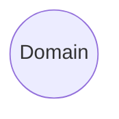
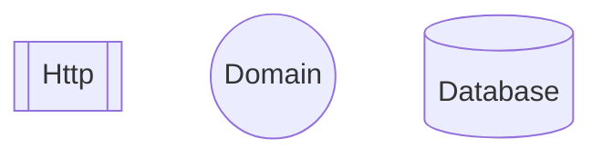
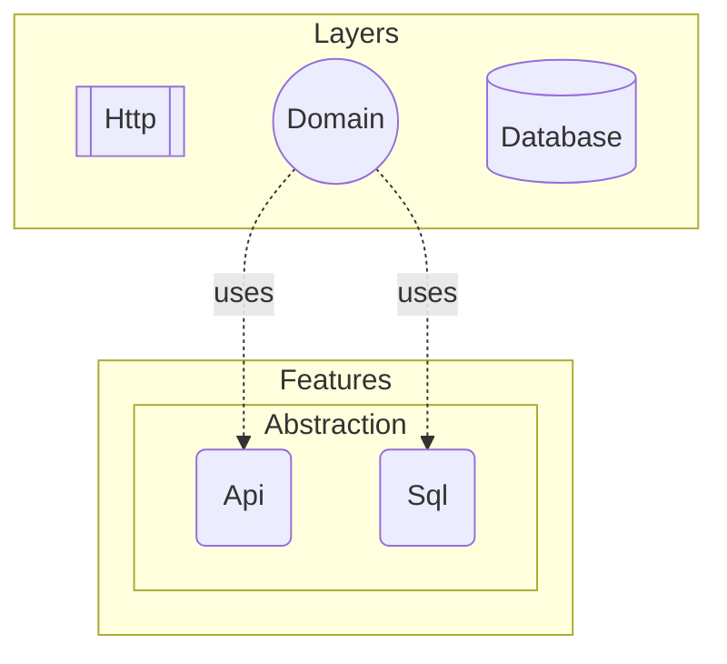
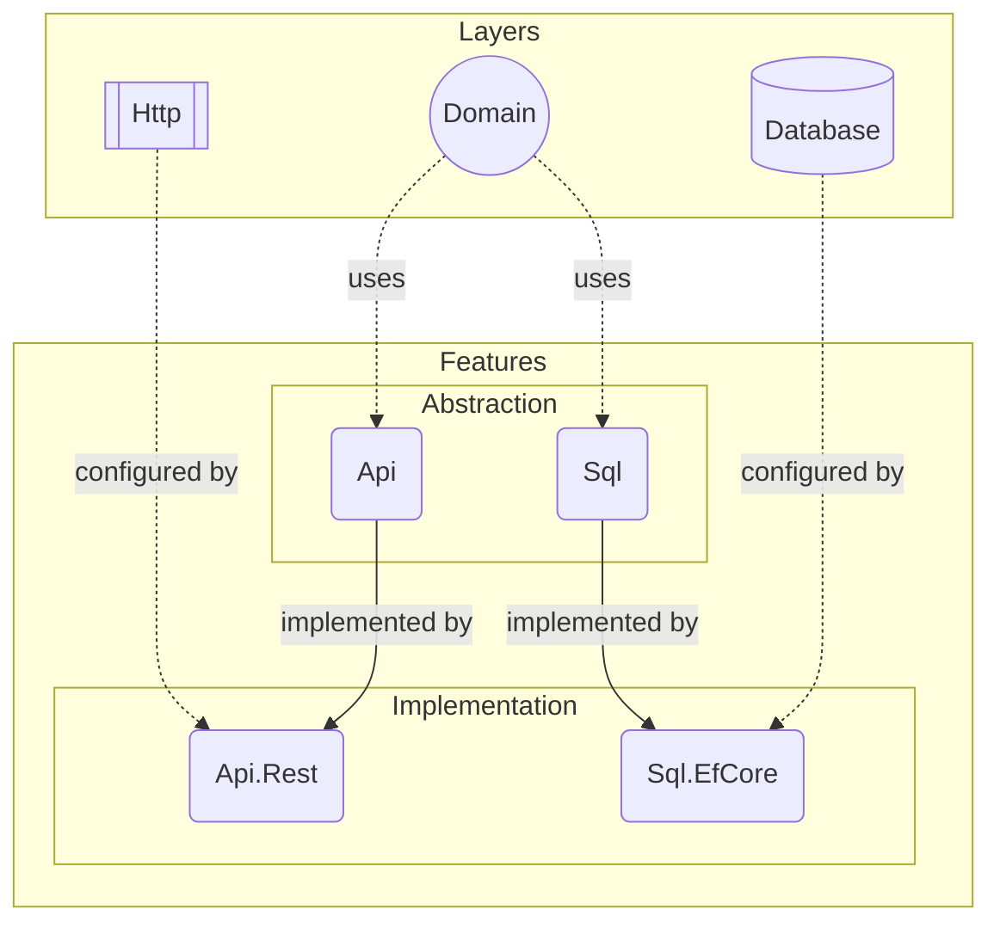

# Architecture

DO is designed to have a simple feature and layer system that enables us to
create software with any architectural style. Core idea is to have good
separation of concerns without causing any repetitive work. To achieve this we
need to break down an application into its individual components.

## Domain

At the core of an application lies its domain logic. By this we understand the
very reason for an application to exist. Everything else exists only to expose
this domain to outside world. So first part is the domain layer.

This layer contains all of the business code of your application. Now we have a
basic definition of what a domain is, but we need to clarify what a layer is.

## Layer

Each layer in DO introduces a new technology, such as a database server, web
server or a framework, to your application architecture. These layers are named
after their concept or protocol it introduces.

> :bulb:
>
> For example, `Do.Http` introduces _HTTP_ protocol as a layer through the
> `ASP.NET Core` framework. Also, `Do.Database` introduces _ORM_ concept as a
> layer through the `EF Core` framework.

But your domain objects would not just be exposed as API endpoints and mapped
onto a relational database. For that, we need to be able to configure those
layers so that they know how to interpret your domain objects.

This is why every layer comes with its own configuration API that is spesific
to the technology it uses. This API may contain a bunch of helper classes
and/or façade methods that makes it easy to build a certain type of
configuration, but they do __not__ have opinions upfront.

> :information_source:
>
> Another perspective to define whether a component is a layer or not is that;
>
> If it introduces an internal system component like a database, message queue
> server, web server, a framework; then it __is__ a layer.
>
> If it is a cloud service that your software depends on, then it should
> __not__ be a layer. External system components are defined as feature
> implementations (adapters) which we'll cover in the next section.

## Feature

A feature is an ability for a domain logic to use in order to access other
software components. Different domains require different types of abilities.
Every feature consists of two parts; abstraction (port) and implementation
(adapter).

### Abstraction

An abstraction is the library that contains all common classes, interfaces,
attributes, if any, for a feature. It is the only accessible part of a feature
from the domain layer or from other feature implementations.

> :information_source:
>
> Features can have only one abstraction and they are named after the ability
> they introduce, e.g. `Do.Fs`, `Do.Sql`, `Do.Nosql`, `Do.Logging`, `Do.Auth`
> etc.

### Implementation

This is the adapter part of a feature which provides implementation(s) for
interfaces in the abstraction part as well as opinionated configurations using
corresponding layer's configuration API.

> :information_source:
>
> A feature might configure more than one layer to achieve its functionality.

Features may have more than one implementation and each implementation is named
after its identifying design or technology, e.g. `Do.Api.Rest`,
`Do.Auth.Auth0`, `Do.Fs.Aws`, `Do.Sql.EfCore`.

> :bulb:
>
> `Do.Fs` represents file system feature that provides an API to your domain
> logic to read/write files. `Do.Fs.Local` and `Do.Fs.AwsS3` are two different
> implementations that provides the same functionality through different system
> components.

Feature implementations are bridges that connects layers with opinionated
configuration to the domain layer. Now our sample architecture is finally
complete;

#### Dependencies

It is possible for a feature to depend on another one. If this is the case,
then it uses the abstraction of that other feature. Direct dependency between
features is forbidden.

A feature might depend on a layer or another feature strictly. In this case, an
application must have dependent features and layers in order to add depending
feature. Mostly, this dependency is soft, which means you can add that feature
even if your application doesn't have its dependent features or layers.
