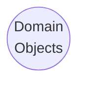
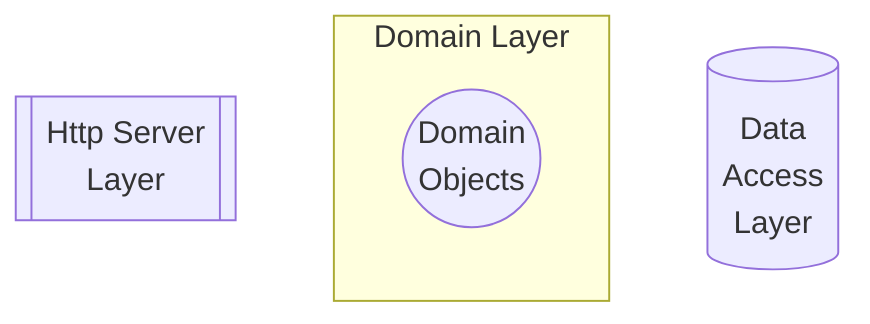
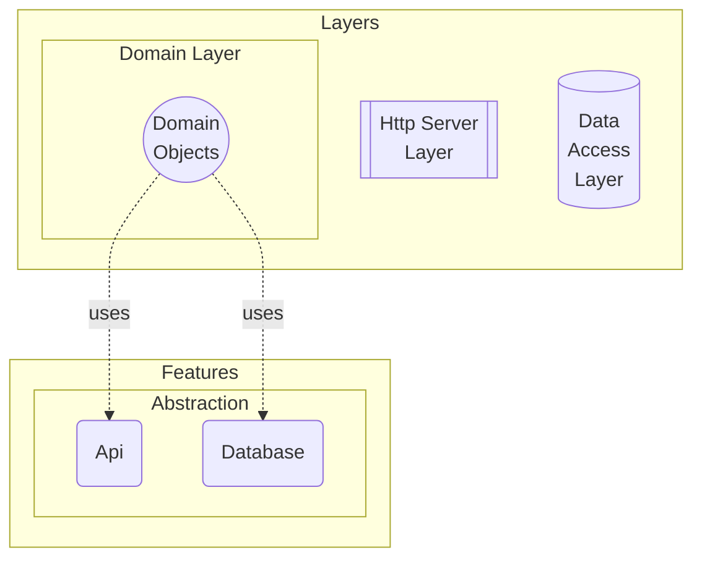
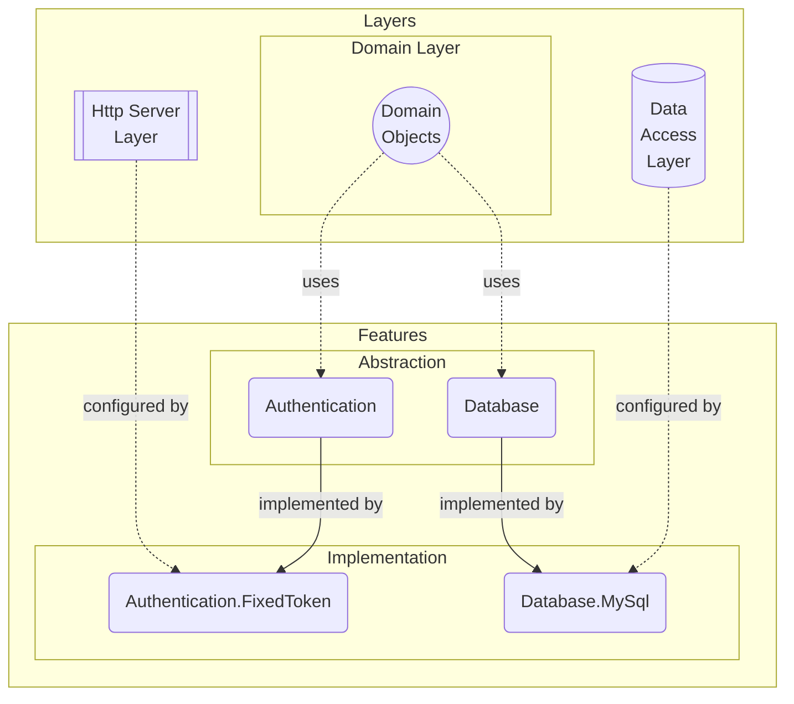

---
pages:
  - application
  - layer
  - feature
---

# Architecture

DO's architectural core is designed to allow us to build software with any
architectural style. Core idea is to enable a good separation of concerns
without causing any repetitive work. To achieve this DO breaks down an
application into following components: domain objects, layers and features.

> :information_source:
>
> DO is inspired by [Clean Architecture][], but it has its own approach to the
> concept.

Let's dive into each type of software component to have a better understanding
of how DO is structured.

## Domain Objects

At the core of an application lies its domain logic. By this we understand the
very reason for an application to exist. Everything else exists only to expose
this domain to outside world. So first component is domain objects;

## Layers

Second component is layers. Every layer introduces a new technology, such as a
database server, message queue server or a framework, into your application
architecture.

> :bulb:
>
> Layers are named after the concept of their technology.

In this example, `HttpServer` introduces the concept of web as a layer through
the `ASP.NET Core` technology. Also, `DataAccess` introduces the concept of
relational databases as a layer through the `NHibernate` framework.

> :information_source:
>
> `Domain` is a unique layer that introduces the business logic of an
> application by encapsulating its domain objects. It processes the assemblies
> to create an application schema, so that it can be used in creating
> configuration, conventions and/or generating source code.

For domain objects to be exposed as API endpoints or mapped onto a relational
database, layers require an insight about how to interpret domain objects.

This is why every layer comes with its own configuration that is specific to
the technology it uses. Configurations may contain a set of helper classes
and/or facade methods that makes it easy to build a certain type of
configuration, but they do __not__ have opinions upfront.

## Features

Finally, features connect layers in an opinionated way to introduce new
behaviours to the application. Features consist of two parts; an optional
abstraction (port) and a required implementation (adapter).

### Abstraction

An abstraction is the library that contains all common classes, interfaces,
attributes, if any, for a feature. It is the only accessible part of a feature
from domain objects or from other feature implementations.

> :information_source:
>
> Each feature has only one abstraction, named after the ability it provides,
> e.g. `Fs`, `Orm`, `Logging`, `Auth` etc.

### Implementation

This is the implementation part of a feature that provides concrete
implementations for the interfaces defined in the abstraction, along with
opinionated configurations using the configuration API of the corresponding
layer(s).

Features may have multiple implementations, each named after its corresponding
design or technology, e.g. `Auth.Auth0`, `Fs.Aws`, `Database.MySql`.

> :bulb:
>
> `Fs` represents file system feature that provides an API to your domain logic
> to read/write files. `Fs.Local` and `Fs.AwsS3` are two different
> implementations that provides the same functionality through different system
> components.

In conclusion, feature implementations serve as bridges, connecting layers to
each other through their opinionated configurations. Below is a complete sample
architecture, showcasing the integration of domain logic, layers and features;

[Clean Architecture]: https://learn.microsoft.com/en-us/dotnet/architecture/modern-web-apps-azure/common-web-application-architectures#clean-architecture
