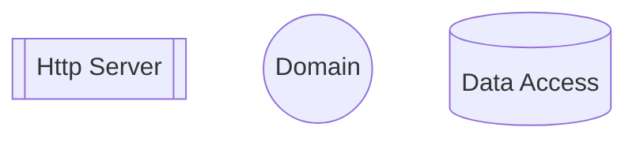
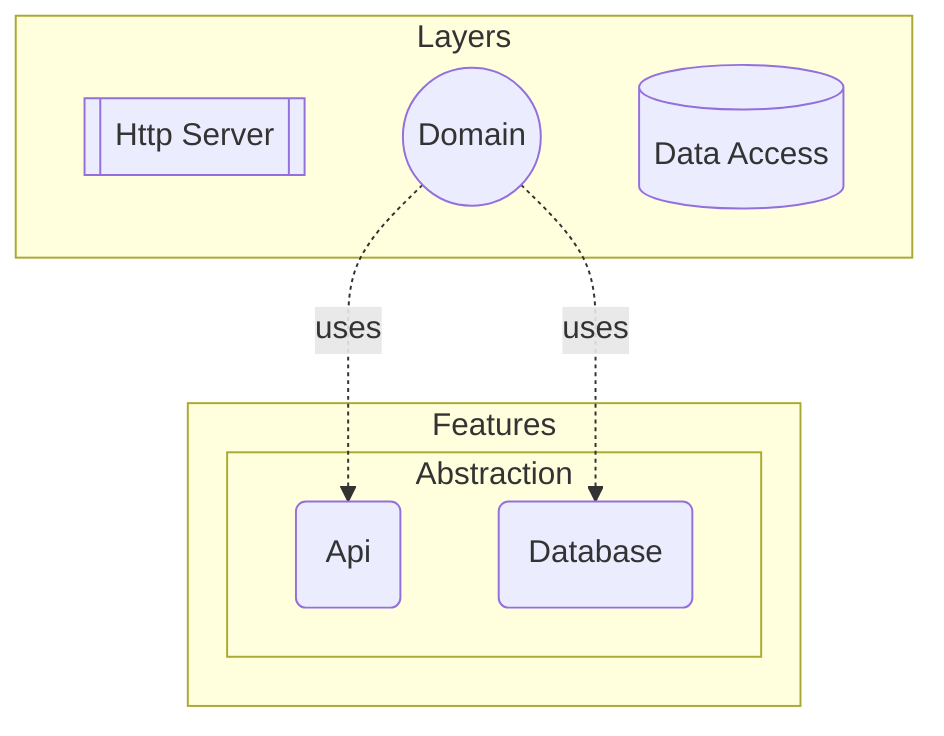
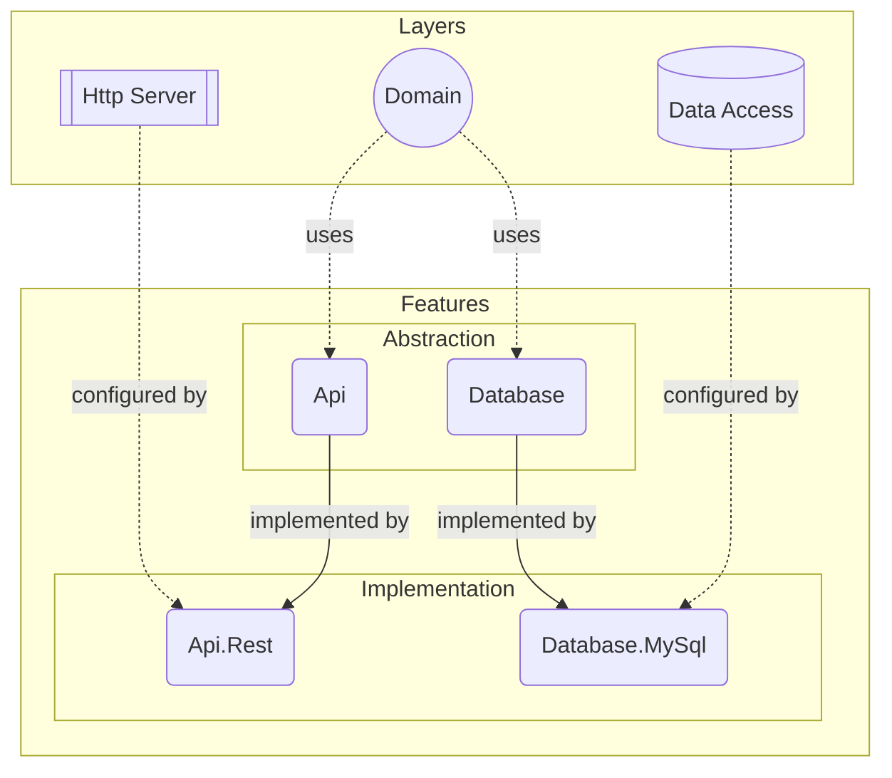

---
pages:
  - application
  - layer
  - feature
---

# Architecture

DO is designed to be a framework that allows us to build software with any
architectural style. Core idea is to have good separation of concerns without
causing any repetitive work. To achieve this we need to break down an
application into its individual components such as features, layers and domain
logic.

> :information_source:
>
> DO is inspired by [Clean Architecture][], but it has its own approach to the
> concept.

Let's dive into each type of software component to have a better understanding
of how DO is structured.

## Domain

At the core of an application lies its domain logic. By this we understand the
very reason for an application to exist. Everything else exists only to expose
this domain to outside world. So first part is the domain layer.

This layer contains all of the business code of your application. Now we have a
basic definition of what a domain is, but we need to clarify what a layer is.

## Layer

Each layer in DO introduces a new technology, such as a database server,
message queue server or a framework, into your application architecture. These
layers are named after the domain of their technology.

In this example, `HttpServer` introduces the concept of web as a layer through
the `ASP.NET Core` technology. Also, `DataAccess` introduces the concept of
relational databases as a layer through the `EF Core` framework.

> :information_source:
>
> `Domain` differs from other layers like `HttpServer` and `DataAccess`. It is a
> special kind of layer that processes your domain assemblies to create an
> application schema out of your domain objects so that they can be used in
> creating configuration, conventions and/or generating source code.

But your domain objects would not just be exposed as API endpoints and mapped
onto a relational database. For that, we need to be able to configure those
layers so that they know how to interpret your domain objects.

This is why every layer comes with its own configuration that is specific to
the technology it uses. This configuration may contain a set of helper classes
and/or facade methods that makes it easy to build a certain type of
configuration, but they do __not__ have opinions upfront.

In other words;

- If it introduces an internal system component like a database, message queue
  server, web server, a framework; then it __is__ a layer.

- If it is an external system component such as a cloud service, then it should
  __not__ be a layer. External system components are defined as feature
  implementations (adapters) which we'll cover in the next section.

## Feature

Feature is a component which can configure individual layers, introduce new 
behaviour using layers and other feature ports or register components 
for providing APIs to domain layer to other software components. 

Every feature consists of two parts; abstraction (port) and implementation 
(adapter).

### Abstraction

An abstraction is the library that contains all common classes, interfaces,
attributes, if any, for a feature. It is the only accessible part of a feature
from the domain or from other feature implementations.

> :information_source:
>
> Each feature has only one abstraction, named after the ability it provides,
> e.g. `Fs`, `Orm`, `Logging`, `Auth` etc.

### Implementation

This is the implementation part of a feature that provides concrete
implementations for the interfaces defined in the abstraction, along with
opinionated configurations using the configuration API of the corresponding
layer.

> :information_source:
>
> A feature may configure multiple layers to achieve its functionality.

Features may have multiple implementations, each named after its corresponding
design or technology, e.g. `Auth.Auth0`, `Fs.Aws`, `Database.MySql`.

> :bulb:
>
> `Fs` represents file system feature that provides an API to your domain logic
> to read/write files. `Fs.Local` and `Fs.AwsS3` are two different
> implementations that provides the same functionality through different system
> components.

In conclusion, feature implementations serve as bridges, connecting the domain
or layers to other layers through their opinionated configurations. Below is a
complete sample architecture, showcasing the integration of layers, features
and the domain layer;

[Clean Architecture]:https://learn.microsoft.com/en-us/dotnet/architecture/modern-web-apps-azure/common-web-application-architectures#clean-architecture
