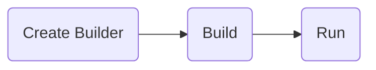
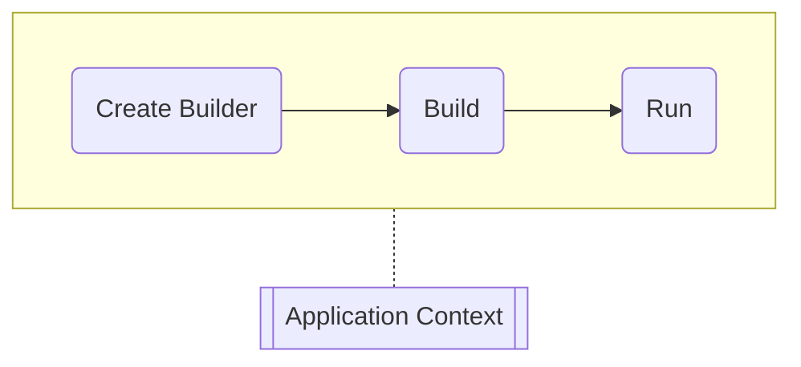
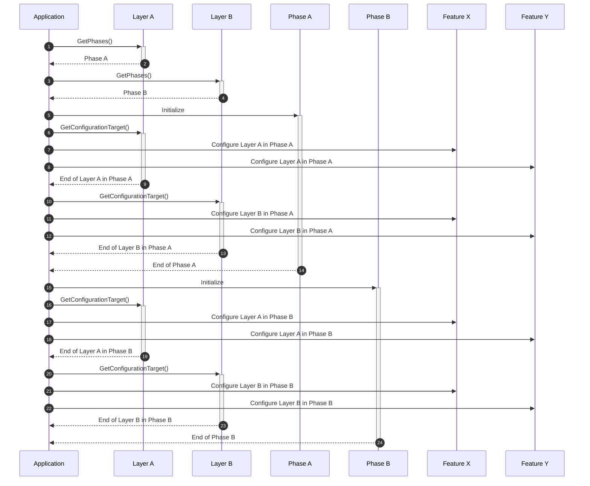

# Application

`Application` acts as a container object for all the domain objects, features
and layers of the software you develop. This object is built through a bunch of
extensible builder classes and methods.

## Building an Application

DO provides a fluent interface to build an application. You can access it
through `Build.Application` under `Do` namespace. Below is a sample
`Program.cs` that builds and runs a DO application;

```csharp
Build.Application
    .As(app =>
    {
        ...
    })
    .Run();
```

> :information_source:
>
> `Do` is automatically added as a global using so that you can directly make a
> call to `Build.Application`.

## Adding Extensions

To add a new extension to an application, you need to make use of feature /
layer system.

DO does not allow you to use `build.Services.Add` or `app.Use` methods
directly. This is a design decision to avoid any unexpected behaviour because
the order of extensions may require a special attention as in [Enabling
Cors][].

`As` method provides an `Application` instance with `Layers` and `Features`
properties. Using these properties you may add needed extensions into your
application.

> :information_source:
>
> Layers and features come with extension methods exposed directly in `Do`
> namespace so that you can see options without adding an extra `using`.

### Layers

Layers can be added without any options to configure;

```csharp
app.Layers.AddDomain();
app.Layers.AddWeb();
app.Layers.AddDatabase();
```

To configure a layer, you need to add a feature mentioned in the next section.
More on layers can be found at [Layer](layer.md).

### Features

Features are added using one of the implementations available in given
configurator;

```csharp
app.Features.AddApi(c => c.Rest());
app.Features.AddOrm(c => c.EfCore());
```

An implementation may ask for additional options within its configurator
method;

```csharp
app.Features.AddOrm(c => c.EfCore(primaryKeyPrefix: "PK_"))
```

## Running an Application

To run an application you need to call `Run()` method after building it.

```csharp
Build.Application
    .As(app =>
    {
        app.Layers.AddWeb();
    })
    .Run();
```

Application runs in phases provided by its layers. For example an ASP.NET Core
application typically runs in 3 phases;



These phases come from layers using `GetPhases()` method of `ILayer`. In the
above example, `WebLayer` (ASP.NET Core) introduced these three phases.

At the beginning of each phase, application initializes it by providing an
`ApplicationContext` instance. This way each phase can add/get certain objects
to/from the context, such as `IServiceCollection`, `IApplicationBuilder`,
`IEndpointRouteBuilder` etc.



As mentioned [earlier](./README.md), layers provide features with things to
configure. For this to happen, application asks every layer what to configure
at each phase. If a layer has something to get configured at a phase, such as
the `IApplicationBuilder` at the _Build_ phase, it returns that object in
`ILayer.GetConfigurationTarget()` where application passes it to all of the
features through `IFeature.Configure()`.

Below sequence diagram showcases how an application runs in phases. In this
diagram there are two layers (`A` and `B`), each having one phase, and two
features (`X` and `Y`);



> :information_source:
>
> A layer doesn't necessarily introduce new phases to an application, but all
> phases are applied to all layers nevertheless. For example, `WebLayer`
> introduces _Build_ phase which is applied to `Domain`, `Web` and `Database`
> layers to allow them provide their configuration targets specific to the
> _Build_ phase.

### Order of Phases

> TBD

[Enabling Cors]:https://learn.microsoft.com/en-us/aspnet/core/security/cors#enable-cors
