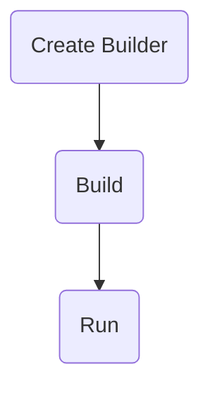
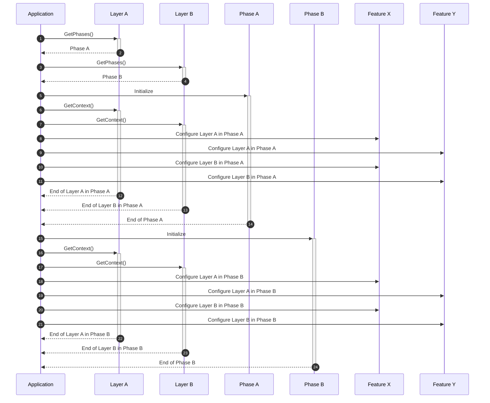
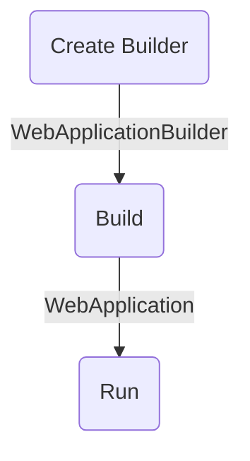

# Application

`Application` acts as a container object for all the domain objects, features
and layers of the software you develop.

## Forging an Application

DO provides a fluent interface to create an application. You can access it
through `Forge.New` under `Do` namespace. Below is a sample `Program.cs` that
creates and runs a new application;

```csharp
Forge.New
    .Application(app =>
    {
        ...
    })
    .Run();
```

> :information_source:
>
> `Do` is automatically added as a global using so that you can directly make a
> call to `Forge.New`.

## Adding Extensions

To add a new extension to an application, you need to make use of the feature /
layer system.

DO does not allow you to use `build.Services.Add` or `app.Use` methods
directly. This is a design decision to avoid any unexpected behavior because
the order of extensions may require a special attention as in [Enabling
Cors][].

`As` method provides an `ApplicationDescriptor` instance that has `Layers` and
`Features` properties. Using these properties, you can add desired extensions
into your application.

> :information_source:
>
> Layers and features come with extension methods exposed directly in `Do`
> namespace so that you can see options without adding an extra `using`.

### Layers

Layers are added without any options to configure;

```csharp
app.Layers.AddDomain();
app.Layers.AddHttpServer();
app.Layers.AddDataAccess();
```

> :information_source:
>
> A layer can only be added once.

To configure a layer, you need to add a feature mentioned in the next section.

### Features

Features are added using one of the implementations available in given
configurator;

```csharp
app.Features.AddGreeting(c => c.WelcomePage());
app.Features.AddDatabase(c => c.MySql());
```

> :information_source:
>
> A feature can only be added once.

An implementation may ask for additional options within its configurator
method;

```csharp
app.Features.AddDatabase(c => c.MySql(autoUpdateSchema: true));
```

#### Overriding A Configuration

To override configurations of added features, follow
[feature conventions](feature.md#conventions), create a
`ConfigurationOverrider` feature and add your overrider after all other
features as shown below;

```csharp
app.Features.AddGreeting(c => c.WelcomePage());
app.Features.AddDatabase(c => c.MySql());
...
app.Features.AddConfigurationOverrider();
```

## Running an Application

To run an application you need to call `Run()` method after forging it.

```csharp
Forge.New
    .Application(app =>
    {
        ...
    })
    .Run();
```

Application runs in phases provided by its layers. For example an `HttpLayer` 
uses ASP.NET Core application typically runs in three phases;



These phases come from layers using `GetPhases()` method of `ILayer`. In the
above example, `HttpServerLayer` (ASP.NET Core) introduced these three phases.

At the beginning of each phase, application initializes it by providing an
`ApplicationContext` instance. This way each phase can add/get certain objects
to/from the context, such as `IServiceCollection`, `IMiddlewareCollection`,
`IEndpointRouteBuilder` etc. 
Refer to [Readiness via Dependencies](./layer.md#readiness-via-dependencies) 
for more details.

> :warning:
>
> When trying to get a certain object from `ApplicationContext`, exact type
> should be given. Using any other type that extends or implements the target
> object will result in an unsuccessful `Get` operation. For example, trying to
> `Get` a `WebApplication` using `IApplicationBuilder` type will be unsuccessful.

As mentioned [earlier](./README.md#layer), layers provide features with things
to configure. For this to happen, application asks every layer what to configure
at each phase. If a layer has something to get configured at a phase, such as
the `IMiddlewareCollection` at the _Build_ phase, it returns that object within
a phase context in `ILayer.GetContext()`. Using this phase context, application
passes the provided object(s) to all of the features through
`IFeature.Configure()`. Phase contexts are disposed at the end of their phase.

Below sequence diagram shows how an application runs in phases. In this diagram
there are two layers (`A` and `B`), each having one phase, and two features
(`X` and `Y`);



> :information_source:
>
> A layer doesn't necessarily introduce new phases to an application, but all
> phases are applied to all layers nevertheless. For example, `HttpServerLayer`
> introduces _Build_ phase which is applied to `Domain`, `HttpServer` and
> `DataAccess` layers to allow them provide their configuration specific to the
> _Build_ phase.

### Order of Phases

Initialization order of phases are determined by;

1. Readiness of a phase through `IPhase.IsReady` property,
1. Value of `IPhase.Order` property,
1. And the order they are added to the application.

Application checks if a phase is ready and if it is not, application keeps it
for the next iteration of initializations.

A phase makes use of given application context to determine if it is ready to
be initialized or not. For example, `Run` phase looks for `WebApplication` in
the given context. If it does not, phase decides not to initialize. This way
application knows that `Run` phase is not ready until some other phase, e.g.,
`Build` phase, adds `WebApplication` to the context.



> :information_source:
>
> All phases need to initialize. Application will cause a
> `CannotProceedException` if any of the phases never gets initialized.

When two phases are ready to be initialized at the same iteration, application
sorts them by their `Order` property. A phase can have the following orders;

1. Earliest
1. Early
1. Normal
1. Late
1. Latest

Application may have any number of phases with the same order at the same
iteration. So in that case, they will initialize in the order they are provided
from layers.

#### Earliest and Latest Phases

There should be only one _earliest_ phase and one _latest_ phase per iteration.
If there are multiple _earliest_ or _latest_ phases, application will throw an
`OverlappingPhaseException` and execution will stop. If you see this exception,
it means you need to reorder phases so that they don't overlap, or you might
change their readiness so that they run in their own iteration.

These special values ensures certain phases are initialized firstly or lastly.
For example, the first phase of `HttpServerLayer`, _Create Builder_, adds
`WebApplicationBuilder` to the application context, which should be the first
thing to be done when running an application. To ensure this, _Create Builder_
should be able to declare itself to be the only _earliest_ phase of its
iteration.

[Enabling Cors]:https://learn.microsoft.com/en-us/aspnet/core/security/cors#enable-cors
