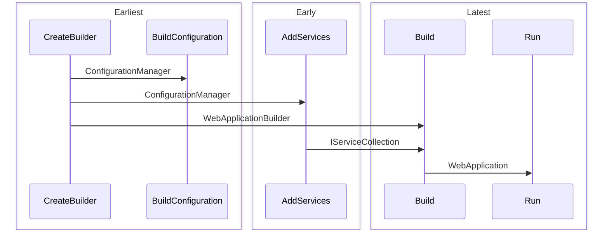

# Service

Service blueprint will be the default backend blueprint that DO provides. This
blueprint is under development and will be detailed as it becomes more mature.

Layers in this blueprint are;

| Layers               | Run | Test |
| -------------------- | --- | ---- |
| Configuration        | +   | +    |
| Data Access          | +   | +    |
| Dependency Injection | +   | +    |
| Http Server          | +   |      |
| Monitoring           | +   | +    |
| Rest Api             | +   | +    |
| Testing              |     | +    |

Features with default options are;

| Features           | Run         | Test            | Required |
| ------------------ | ----------- | --------------- | -------- |
| Business           |             |                 | Yes      |
| Core               | Dotnet      | Mock            |          |
| Database           | Sqlite      | InMemory        | Yes      |
| Documentation      | Default     |                 |          |
| Exception Handling | Default     |                 |          |
| Greeting           | Hello World |                 |          |
| Logging            | Request     |                 |          |
| Mocking Overrider  |             | First Interface |          |
| Orm                | Default     | Default         |          |

Phase execution order is;

