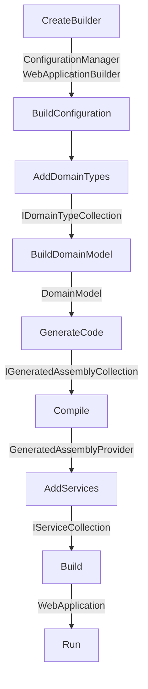

# Service

Service blueprint is the default backend blueprint provided by DO which
includes necessary layers and feature implementations for any backend
application.

> [!TIP]
>
> This blueprint is under development and will be detailed as it becomes more
> mature.

To create an application from this blueprint, use `Service()` extension of
`Forge` class directly in `Program.cs`.

```csharp
Forge.New
    .Service(
        business: c => c.DomainAssemblies([...])
    )
    .Run();
```

Layers in this blueprint are;

| Layers               | Run                | Test               |
| -------------------- | ------------------ | ------------------ |
| Code Generation      | :white_check_mark: | :white_check_mark: |
| Configuration        | :white_check_mark: | :white_check_mark: |
| Data Access          | :white_check_mark: | :white_check_mark: |
| Dependency Injection | :white_check_mark: | :white_check_mark: |
| Domain               | :white_check_mark: | :white_check_mark: |
| HTTP Client          | :white_check_mark: | :no_entry:         |
| HTTP Server          | :white_check_mark: | :no_entry:         |
| Monitoring           | :white_check_mark: | :white_check_mark: |
| Rest API             | :white_check_mark: | :no_entry:         |
| Testing              | :no_entry:         | :white_check_mark: |

Features with default options are;

| Features           | Run                              | Test                               |
| ------------------ | -------------------------------- | ---------------------------------- |
| Authentication     | :white_check_mark: Fixed Token   | :no_entry:                         |
| Business           | :white_check_mark: (No Default)  | :white_check_mark:                 |
| Caching            | :white_check_mark: Scoped Memory | :white_check_mark:                 |
| Coding Style       | :white_check_mark:               | :white_check_mark:                 |
|                    | Object as JSON                   |                                    |
|                    | Remaining Services are Singleton |                                    |
|                    | Rich Entity                      |                                    |
|                    | Scoped by Suffix                 |                                    |
|                    | Use Built-in Types               |                                    |
|                    | With Method                      |                                    |
| Communication      | :white_check_mark: HTTP          | :white_check_mark: Mock            |
| Core               | :white_check_mark: Dotnet        | :white_check_mark: Mock            |
| Database           | :white_check_mark: Sqlite        | :white_check_mark: In Memory       |
| Exception Handling | :white_check_mark: Default       | :white_check_mark:                 |
| Greeting           | :white_check_mark: Swagger       | :no_entry:                         |
| Logging            | :white_check_mark: Request       | :no_entry:                         |
| Mocking Overrider  | :no_entry:                       | :white_check_mark: First Interface |
| ORM                | :white_check_mark: Auto Map      | :no_entry:                         |

Phase execution order;


