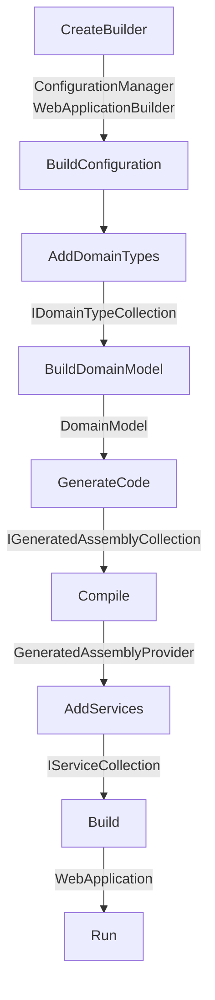

# Service

Service blueprint is the default backend blueprint provided by DO which
includes necessary layers and feature implementations for any backend
application.

> [!TIP]
>
> This blueprint is under development and will be detailed as it becomes more
> mature.

To create an application from this blueprint, use `Service()` extension of
`Forge` class directly in `Program.cs`.

```csharp
Forge.New
    .Service(
        business: c => c.DomainAssemblies([...])
    )
    .Run();
```

Layers in this blueprint are;

| Layers               | Run | Test |
| -------------------- | --- | ---- |
| Code Generation      | +   | +    |
| Configuration        | +   | +    |
| Data Access          | +   | +    |
| Dependency Injection | +   | +    |
| Domain               | +   | +    |
| HTTP Client          | +   |      |
| HTTP Server          | +   |      |
| Monitoring           | +   | +    |
| Rest API             | +   |      |
| Testing              |     | +    |

Features with default options are;

| Features           | Run           | Test            | Required |
| ------------------ | ------------- | --------------- | -------- |
| Authentication     | Fixed Token   | Fixed Token     |          |
| Business           |               |                 | Yes      |
| Caching            | Scoped Memory | Scoped Memory   |          |
| Communication      | Http          | Mock            |          |
| Core               | Dotnet        | Mock            |          |
| Database           | Sqlite        | In Memory       |          |
| Exception Handling | Default       | Default         |          |
| Greeting           | Swagger       |                 |          |
| Logging            | Request       |                 |          |
| Mocking Overrider  |               | First Interface |          |
| ORM                | Auto Map      | Auto Map        |          |

Phase execution order;


