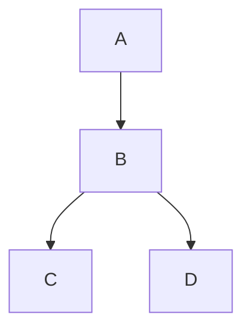
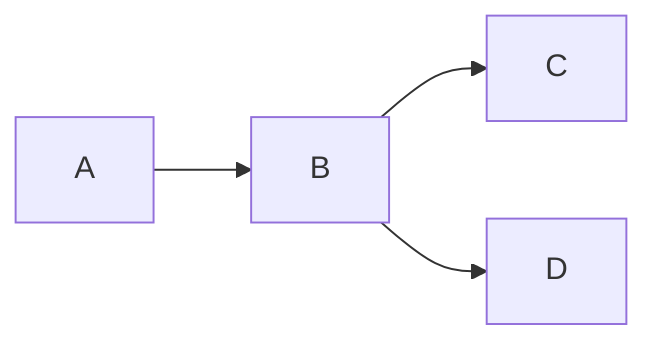

# Demo

This is a demo page that showcases usages of all types of documentation
components.

## Alert Boxes

> :bulb:
>
> this is tip

> :information_source:
>
> this is info

> :warning:
>
> this is warning

> :x:
>
> this is error

> this is pure blockquote

## Code Blocks

This is a `code` within a paragraph.

```csharp
public class DoDemo
{
    public void SayHello()
    {
        Console.WriteLine("Hello Do");
    }
}
```

## Diagrams

### Vertical



### Horizontal



## Links

This is an [internal Link](./README.md). This is an [external Link](https://github.com/mouseless/do).

## Lists

- This
- is
- unordered
  - list

1. This
1. is
   1. ordered
   1. list

## Tables

| Col 1  | Col 2  |
| ---    | ---    |
| Cell 1 | Cell 2 |
| Cell 3 | Cell 4 |
