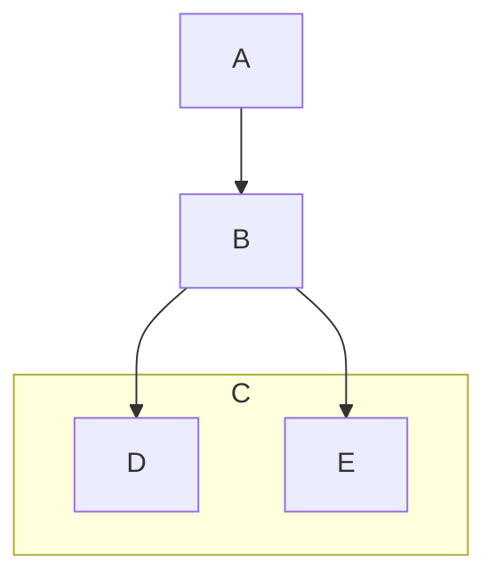
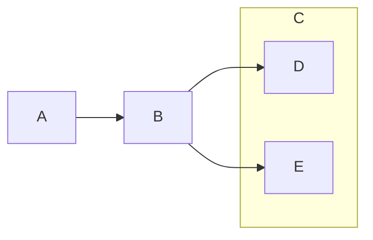

# Demo

This is a demo page that showcases usages of all types of documentation
components.

## Alert Boxes

> [!TIP]
>
> this is tip

> [!NOTE]
>
> this is info

> [!WARNING]
>
> this is warning

> [!CAUTION]
>
> this is error

> this is pure blockquote

### Long Text

> [!WARNING]
>
> Lorem ipsum dolor sit amet, consectetur adipiscing elit, sed do eiusmod
> tempor incididunt ut labore et dolore magna aliqua. Sit amet venenatis urna
> cursus eget nunc scelerisque viverra. Pellentesque diam volutpat commodo sed
> egestas. Odio facilisis mauris sit amet massa vitae. Lectus proin nibh nisl
> condimentum. Metus aliquam eleifend mi in nulla posuere sollicitudin aliquam.
> Venenatis a condimentum vitae sapien pellentesque habitant morbi tristique.
> Urna porttitor rhoncus dolor purus non. Purus non enim praesent elementum
> facilisis leo. Id aliquet risus feugiat in ante metus dictum at. Et molestie
> ac feugiat sed lectus vestibulum mattis. Vel pretium lectus quam id leo in.
> Sed pulvinar proin gravida hendrerit lectus a. Amet mattis vulputate enim
> nulla. Volutpat lacus laoreet non curabitur gravida arcu ac. Vulputate eu
> scelerisque felis imperdiet proin fermentum leo vel orci. Faucibus purus in
> massa tempor. Ullamcorper dignissim cras tincidunt lobortis feugiat.
>
> Sed egestas egestas fringilla phasellus faucibus scelerisque eleifend donec
> pretium. Arcu bibendum at varius vel pharetra vel turpis. Faucibus vitae
> aliquet nec ullamcorper sit amet. Gravida quis blandit turpis cursus in hac.
> Sapien pellentesque habitant morbi tristique. Aliquet lectus proin nibh nisl.
> Posuere ac ut consequat semper viverra nam libero justo laoreet. Turpis
> egestas pretium aenean pharetra magna ac. Odio eu feugiat pretium nibh ipsum
> consequat nisl vel pretium. Ornare arcu dui vivamus arcu. Id neque aliquam
> vestibulum morbi blandit cursus risus at ultrices. Pellentesque nec nam
> aliquam sem et tortor consequat id porta.

## Code Blocks

This is a `code` within a paragraph.

```csharp
public class DoDemo
{
    public void SayHello()
    {
        Console.WriteLine("Hello Do");
    }
}
```

### `code` in Header

> [!NOTE]
>
> Code in alert box;
>
> ```csharp
> public class DoDemo
> {
>     public void SayHello()
>     {
>         Console.WriteLine("Hello Info Box");
>     }
> }
> ```

## Diagrams

### Vertical



### Horizontal



## Horizontal Ruler

---

## Links

This is an [internal Link](./README.md). This is an [external
Link](https://github.com/mouseless/baked).

## Lists

- This
- is
- unordered
  - list

1. This
1. is
   1. ordered
   1. list

## Tables

| Column 1 | Column 2 | Column 3 | Column 4 |
| ---      | ---      | ---      | ---      |
| Cell 1.1 | Cell 2.1 | Cell 3.1 | Cell 4.1 |
| Cell 1.2 | Cell 2.2 | Cell 3.2 | Cell 4.2 |
| Cell 1.3 | Cell 2.3 | Cell 3.3 | Cell 4.3 |
| Cell 1.4 | Cell 2.4 | Cell 3.4 | Cell 4.4 |

### with wide cells

| Column 1                 | Column 2                 | Column 3                 |
| ---                      | ---                      | ---                      |
| Cell.That.Is.Really.Wide | Cell.That.Is.Really.Wide | Cell.That.Is.Really.Wide |
