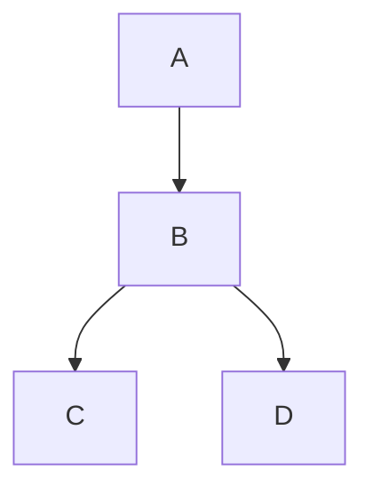
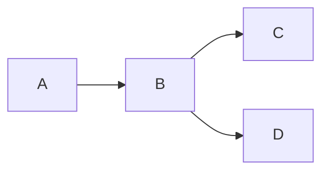

# Demo

This is a demo page that showcases usages of all types of documentation
components.

## Alert Boxes

> :bulb:
>
> this is tip

> :information_source:
>
> this is info

> :warning:
>
> this is warning

> :x:
>
> this is error

## Diagrams

### Vertical

### Horizontal

