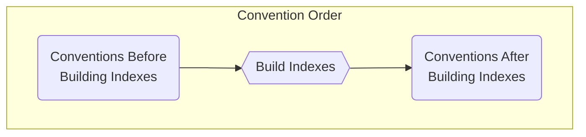

# Domain

Baked introduces a model generation mechanism to reflect the business domain of
a project. The generated model instance can be used directly in layers or in
features while configuring configuration targets.

```csharp
app.Layers.AddDomain();
```

> [!NOTE]
>
> The generated domain metadata files will be saved to `.baked` folder at
> `$(ProjectDir)` of your application project.
>
>```xml
> <Target Name="SetCopyComponentDescriptors" BeforeTargets="Generate">
>   <PropertyGroup>
>     <CopyExportFiles>true</CopyExportFiles>
>     ...
>   </PropertyGroup>
> </Target>
>```

## Configuration Targets

This layer provides `IDomainTypeCollection` and `DomainModelBuilderOptions`
configuration targets for building `DomainModel`, `AttributeDatas` and
`ExportConfigurations` for exporting attribute metadata in `Generate` mode. It
also provides `DomainServiceCollection` configuration target for features to add
`DomainServiceDescriptor` for domain types which then be used to generate an
`IServiceAdder` implementation. The generated `IServiceAdder` is then used in
`Start` mode for auto registering domain types to service collection. Domain
layer also provides an `Inspect` object to inspect on metadata while
`DomainModelBuilder` builds the domain model through conventions.

### `IDomainTypeCollection`

This target is provided in `AddDomainTypes` phase. To configure it in a feature;

```csharp
configurator.Domain.ConfigureDomainTypeCollection(types =>
{
    ...
});
```

### `DomainModelBuilderOptions`

This target exposes options for configuring built-in `DomainModelBuilder` and is
provided in `AddDomainTypes` phase. To configure it in a feature;

```csharp
configurator.Domain.ConfigureBuilder(builder =>
{
    ...
});
```

### `IDomainModelConventionCollection`

This target exposes options for configuring domain conventions and levels and is
provided in `AddDomainTypes` phase. To configure it in a feature;

```csharp
configurator.Domain.ConfigureConventions(conventions =>
{
    ...
});
```

### `DomainServiceCollection`

This target is provided in `Generate` phase and it is used to generate
`IServiceAdder` to add domain services during `AddService` phase in `Start`
mode. To configure it in a feature;

```csharp
configurator.Domain.ConfigureDomainServiceCollection((services, domain) =>
{
    // use domain metadata to register services at generate time
    ...
});
```

### `AttributeProperties`

This target is provided in `Generate` phase and it is used to configure exported
properties for attributes;

```csharp
configurator.Domain.ConfigureAttributeProperties(properties =>
{
    // configure to output desired attribute properties
    ...
});
```

### `ExportConfigurations`

This target is provided in `Generate` phase and it is used to export attribute
data of matching types and their members. To configure it in a feature;

```csharp
configurator.Domain.ConfigureExportConfigurations(exports =>
{
    // configure exports to output desired attribute export files
    ...
});
```

## Phases

This layer introduces following `Generate` phases to the application it is added;

- `AddDomainTypes`: This phase adds an `IDomainTypeCollection` instance to the
  application context
- `BuildDomainModel`: This phase uses domain types to build and add a
  `DomainModel` instance to the application context

> [!TIP]
>
> To access the domain model from a feature use below extension method;
>
> ```csharp
> configurator.UsingDomainModel(domain =>
> {
>     // use domain metadata to configure any configuration target
>     ...
> });
> ```

## Domain Model

`DomainModel` is a reflection cache that stores and reuses type metadata,
properties, methods, parameters, and attribute information. Since baked relies 
on dynamic code generation based on certain set of rules or conventions, 
`DomainModel` serves as the core foundation of the system by providing 
a reusable and extendable reflection metadata.

### Extending Domain Model

Baked utilizes the `Attribute` system to mark or add additional metadata to
reflected types, members, or parameters. All models defined within the 
`DomainModel` has their own attributes collection initialized with dotnet
or user provided attributes, which allows layers and features to define custom 
behaviors, metadata, or runtime behaviours.

In order to create a specific set of rules or behaviors, `DomainLayer` provides 
convention based configuration mechanism which are configured using 
`DomainModelBuilder` configuration target's `Conventions`. 

### Indexing Models

Baked provides indexing mechanism of domain models according to their owned 
or added attributes to improve performance. Indexes of a model in domain can 
be specified from its builder options.

```csharp
configurator.Domain.ConfigureBuilder(builder =>
{
    builder.Index.Type.Add<MyTypeAttribute>();
    builder.Index.Property.Add<MyPropertyAttribute>();
    builder.Index.Method.Add<MyMethodAttribute>();
    builder.Index.Parameter.Add<MyParameterAttribute>();
}
```

When any model type are indexed, they can be accessed using `.Having` extension
method instead of querying through models.

```csharp
foreach(var type in domain.Types.Where(t => t.TryGetMetadata(out var metadata) && metadata.Has<MyTypeAttribute>()))
{
    ...
}

// Indexed, no query needed
foreach(var type in domain.Types.Having<MyTypeAttribute>())
{
    ...
}
```

## Convention System

Attributes can be directly added to types or members as well as using built-in
convetion system of baked. A convention can be used to add/remove or configure
an attribute. Baked provides `IDomainModelConvention<TModel>` to create custom
convention classes and extension methods for `DomainModelConventionCollection` 
to manage attributes.

```csharp
public class IdConvention : IDomainModelConvention<PropertyModelContext>
{
    public void Apply(PropertyModelContext context) 
    {
        if(c.Property.Name != "Id") { continue; }

        ((IMutableAttributeCollection).Property.CustomAttributes).Add(new IdAttribute());
    }
}

configurator.Domain.ConfigureConventions(conventions =>
{
    conventions.Add(new IdConvention());
}
```

### Ordering Conventions

By deault a convention is applied in the order which it is added with respect to
its feature order. A global value can be also set when a specific convention is
required to execute at the exact order. 

```csharp
// program.cs
app.Features.Add(new FeatureA());
app.Features.Add(new FeatureB());

public class FeatureA : IFeature 
{
    // this convention wil apply before conventions
    // in feature B with default order
    conventions.Add(...);
}

public class FeatureB : IFeature 
{
    // This convention will apply first since a
    // global order is given
    conventions.Add(
        ...,
        order: -10  
    );

    // This convention will apply after conventions
    // in feature A
    conventions.Add(...);
}
```

Another key factor that affects convention execution order is whether a
convention should execute before or after indexes are built. Some conventions
may need to modify metadata or add attributes before the indexing stage begins,
so that the attributes they add can be using in `.Having<T>()` clauses in
conventions that run after building indexes. 



To support this behavior, conventions can be marked with the 
`beforeBuildingIndexes` flag. These conventions are grouped and executed in a 
separate stage, guaranteeing that they run before index generation and all 
remaining conventions.

```csharp
// This convention will apply before the indexes are built
conventions.Add(
    new DomainConvention(beforeBuildingIndexes: true)
);

// This convention will apply after the indexes are built
conventions.Add(
    new DomainConvention(beforeBuildingIndexes: false)
);
```

Baked also provides an order matrix system that allows conventions to be grouped 
and executed within a specific stage. This helps organize convention execution 
accross multiple features and provide a predictable ordering between related 
convention groups.

```csharp
configurator.Domain.ConfigureBuilder(builder =>
{
    builder.ConventionOrderMatrix.Bases.Add("Base");
    ...
    builder.ConventionOrderMatrix.Levels.Add("Level");
    ...
    builder.ConventionOrderMatrix.Extensions.Add("Ext");
    ...

    builder.ConventionOrderMatrix.FallbackBase = convention => ...;
    builder.ConventionOrderMatrix.FallbackLevel = convention => ...;
    builder.ConventionOrderMatrix.FallbackExtension = convention => ...;

    builder.DefaultConventionLevel = "...";
});

configurator.Domain.ConfigureConventions(conventions => 
{
    conventions.Add(
        ...,
        order: Order.At.WithBase("Base").WithLevel("Level").WithExtension("Ext")
    );
});
```

When building the order matrix, cnofigured values will be looped in `Base`, 
`Extension` and `Level` sequence to build the final collection which will be
used when calculating exact values of give `Order` values.

```csharp
// This will output the following collection
// [
//     "BaseA.LevelA.ExtA",
//     "BaseA.LevelB.ExtA",
//     "BaseA.LevelA.ExtB",
//     "BaseA.LevelB.ExtB",
//     "BaseB.LevelA.ExtB",
//     "BaseB.LevelB.ExtB",
//     "BaseB.LevelA.ExtB",
//     "BaseB.LevelB.ExtB"
// ]
configurator.Domain.ConfigureBuilder(builder =>
{
    builder.ConventionOrderMatrix.Bases.Add("BaseA");
    builder.ConventionOrderMatrix.Bases.Add("BaseB");
    builder.ConventionOrderMatrix.Levels.Add("LevelA");
    builder.ConventionOrderMatrix.Levels.Add("LevelB");
    builder.ConventionOrderMatrix.Extensions.Add("ExtA");
    builder.ConventionOrderMatrix.Extensions.Add("ExtB");
    ...
});
```

> [!NOTE]
>
> For empty order matrix parts lists, a default value will be used in order
> to generate a complete lists so that every value in the collection will have
> exactly three parts

A convention with given level order will be added to the median, in other words
will have 0 as its offset relative to its level. It is also possible to specify 
min/max values or a specific position within the level.

```csharp
conventions.Add(
    ...,
    order: Order.WithLevel("LevelA").Min
);

conventions.Add(
    ...,
    order: Order.WithLevel("LevelA") + 10
);
```

Prior a convention is added to collection, if a given `Order` has its `Base`, 
`Level` or `Extension` values null, they will be set using configured fallback
values, because calculating an `Order`value in the matrix will requires exact
base point.

```csharp
configurator.Domain.ConfigureBuilder(builder =>
{
    builder.ConventionOrderMatrix.FallbackBase = _ => "BaseB";
    builder.ConventionOrderMatrix.FallbackLevel = _ => "LevelB";
    builder.ConventionOrderMatrix.FallbackExtension = _ => "ExtB";

    builder.DefaultConventionLevel = "...";
});

// The values of the given order will overridden as 'BaseB.LevelA.ExtB'
configurator.Domain.ConfigureConventions(conventions => {
    conventions.Add(
        ...,
        order: Order.Level("LevelA").Min
    );
});
```

> [!NOTE]
>
> All returned fallback values must be added in their corresponding lists,
> if a fallback `Base` is `BaseA`, it must be included in 
> `builder.ConventionOrderMatrix.Bases` collection

#### `Order`

Possible order usages;

```csharp
Order.Global.AbsoluteMin
Order.Global.Min
Order.At.AbsoluteMin
Order.At.Min
Order.At.Zero
Order.At.Max
Order.At.AbsoluteMax
Order.Global.Max
Order.Global.AbsoluteMax

Order.At.WithBase("BaseA");
Order.At.WithBase("BaseA").WithLevel("LevelA");
Order.At.WithBase("BaseA").WithLevel("LevelA").WithExtension("ExtA");
Order.At.WithBase("BaseA").WithExtension("ExtA");
Order.At.WithLevel("LevelA");
Order.At.WithExtension("ExtA");
Order.At.WithBase("BaseA").Min;
Order.At.WithLevel("LevelA").Max;
```

Following operatior overloads are implemented
```csharp
{Order} = {Order} +- {int}
{Order} = {int}

// e.g.
order: Order.WithLevel("my-level") + 10
order: Order.Max - 10
order: 10 // Order.Zero + 10
```

> [!NOTE]
>
> Levels does not allow values exceeding their absolute boundaries, absolute 
> values should be avaoided unless it is requried to override exceptional cases

> [!NOTE]
>
> `Global` order is only affected by its offset value, it cannot be overridden 
> using `With` methods

> [!CAUTION]
>
> Order has range between int.MinValue and int.MaxValue, any
> values exceeding will throw error

## Proxifying Entities

It is possible to avoid adding `protected virtual` and default constructors to
classes (such as entity classes) to enable lazy loading and dynamic proxy.

Please add below references to your projects that contain your domain objects
(projects that depend only to `Baked.Abstractions`).

```xml
<ItemGroup>
  <PackageReference Include="EmptyConstructor.Fody" PrivateAssets="All" />
  <PackageReference Include="Fody" PrivateAssets="All" />
  <PackageReference Include="Publicize.Fody" PrivateAssets="All" />
  <PackageReference Include="Virtuosity.Fody" PrivateAssets="All" />
</ItemGroup>
```

Add versions to `Directory.Packages.props`;

```xml
<PackageVersion Include="EmptyConstructor.Fody" Version="..." />
<PackageVersion Include="Fody" Version="..." />
<PackageVersion Include="Publicize.Fody" Version="..." />
<PackageVersion Include="Virtuosity.Fody" Version="..." />
```

> [!WARNING]
>
> Build your project now. Expect a build fail on your first build after you add
> fody. This fail adds `FodyWeavers.xml` to your project. Following builds will
> success.

> [!TIP]
> You can use `GenerateXsd="false"` property in your `FodyWeavers.xml` to remove
> the extra `.xsd` file
>
> ```xml
> <?xml version="1.0" encoding="utf-8"?>
> <Weavers GenerateXsd="false">
>   <EmptyConstructor />
>   <Publicize />
>   <Virtuosity />
> </Weavers>
> 

### Debugging Domain Model Generation

We provide a tool to debug domain model generation process during a generate phase.

#### `Inspect`

> [!WARNING]
>
> This feature is still in experimentation and might print false-negative
> output, meaning it might not capture every change of the inspected attribute.

This target is provided from `DomainModelBuilderOptions` in `AddDomainTypes` 
phase. To configure it in a feature;

```csharp
configurator.Domain.ConfigureBuilder(builder =>
{
    // To inspect an attribute on types
    builder.Inspect.TypeAttribute<MyAttribute>(
        when: c => c.Type..., // optional to inspect specific type models
        attribute: ma => ma.Value // optional to inspect just this value
    );

    // To inspect an attribute properties
    builder.Inspect.PropertyAttribute<MyAttribute>(
        when: c => c.Property..., // optional to inspect specific property models
        attribute: ma => ma.Value // optional to inspect just this value
    );

    // To inspect an attribute methods
    builder.Inspect.MethodAttribute<MyAttribute>(
        when: c => c.Method..., // optional to inspect specific method models
        attribute: ma => ma.Value // optional to inspect just this value
    );

    // To inspect an attribute parameters
    builder.Inspect.ParameterAttribute<MyAttribute>(
        when: c => c.Parameter..., // optional to inspect specific parameter models
        attribute: ma => ma.Value // optional to inspect just this value
    );

    // To inspect an attribute any member
    builder.Inspect.Attribute<MyAttribute>(
        when: c => c..., // optional to inspect specific members
        attribute: ma => ma.Value // optional to inspect just this value
    );
});
```

> [!NOTE]
>
> Only one inspect is allowed. If you configure more than one,
> `InvalidOperationException` will be thrown