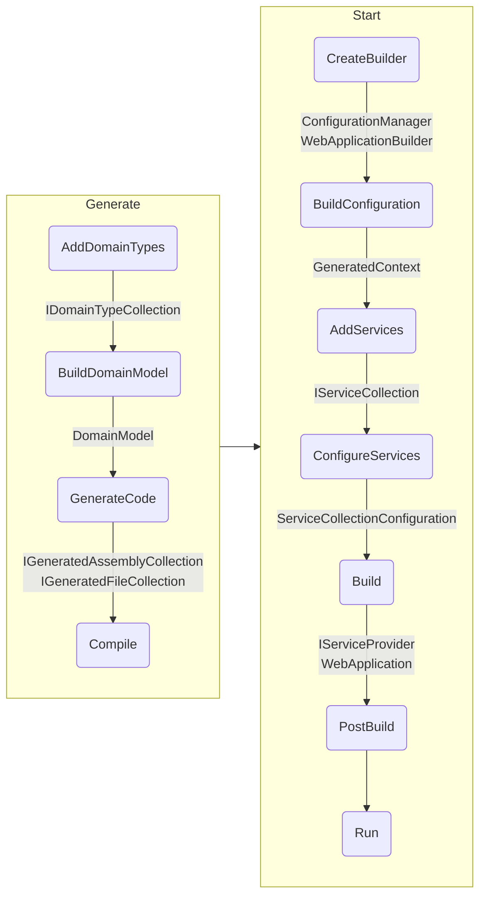

# Data Source

Data source recipe includes enough layers and feature implementations for a
backend application that is expected to provide data from configured data source
using report queries in `.sql` files.

To create an application from this recipe, use `DataSource()` extension of
`Bake` class directly in `Program.cs`.

```csharp
Bake.New
    .DataSource(
        business: c => c.DomainAssemblies([...])
    )
    .Run();
```

## Layers

| Name                 | Run                | Test               |
| ---                  | ---                | ---                |
| Code Generation      | :white_check_mark: | :white_check_mark: |
| Data Access          | :white_check_mark: | :white_check_mark: |
| Domain               | :white_check_mark: | :white_check_mark: |
| HTTP Server          | :white_check_mark: | :no_entry:         |
| Rest API             | :white_check_mark: | :no_entry:         |
| Runtime              | :white_check_mark: | :white_check_mark: |
| Testing              | :no_entry:         | :white_check_mark: |

## Features

| Name               | Run                                | Test                               |
| ---                | ---                                | ---                                |
| Binding            | :white_check_mark: Rest            | :white_check_mark:                 |
| Business           | :white_check_mark: (No Default)    | :white_check_mark:                 |
| Caching(s)         | :white_check_mark:                 | :white_check_mark:                 |
|                    | In-Memory                          |                                    |
|                    | Scoped Memory                      |                                    |
| Coding Style(s)    | :white_check_mark:                 | :white_check_mark:                 |
|                    | Add/Remove Child                   |                                    |
|                    | Command Pattern                    |                                    |
|                    | Id                                 |                                    |
|                    | Initializable                      |                                    |
|                    | Locatable                          |                                    |
|                    | Namespace as Route                 |                                    |
|                    | Records are DTOs                   |                                    |
|                    | Remaining Services are Singleton   |                                    |
|                    | Rich Transient                     |                                    |
|                    | Scoped by Suffix                   |                                    |
|                    | Use Built-in Types                 |                                    |
|                    | Use Nullable Types                 |                                    |
| Core               | :white_check_mark: Dotnet          | :white_check_mark: Mock            |
| Database           | :white_check_mark: Sqlite          | :white_check_mark: In Memory       |
| Exception Handling | :white_check_mark: Problem Details | :white_check_mark:                 |
| Greeting           | :white_check_mark: Swagger         | :no_entry:                         |
| Lifetime(s)        | :white_check_mark:                 | :white_check_mark:                 |
|                    | Singleton                          |                                    |
|                    | Scoped                             |                                    |
|                    | Transient                          |                                    |
| Localization       | :white_check_mark: .NET            | :white_check_mark:                 |
| Logging            | :white_check_mark: Request         | :no_entry:                         |
| Mocking Overrider  | :no_entry:                         | :white_check_mark: First Interface |
| Reporting          | :white_check_mark: NativeSql       | :white_check_mark: Mock            |

> [!NOTE]
>
> When _Test_ column have :white_check_mark: without a note, this means it
> inherits whatever _Run_ column denotes.

## Phase Execution Order


