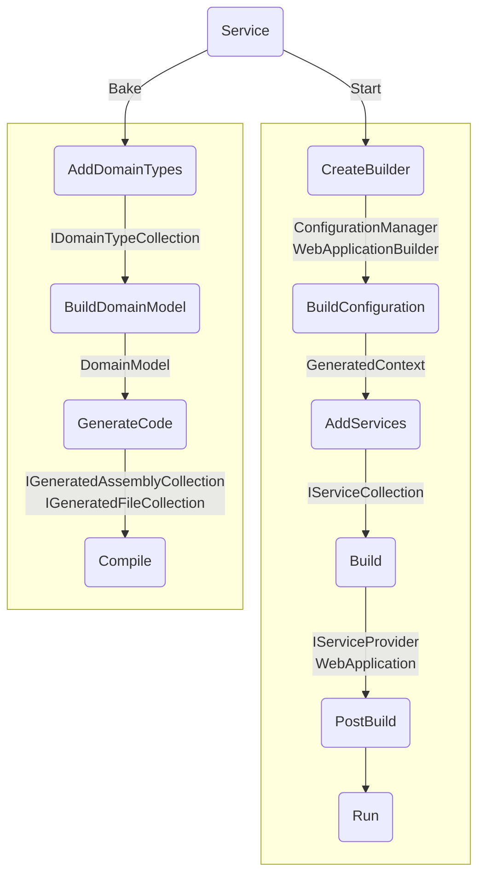

# Service

Service recipe is the default backend recipe provided by Baked which includes
necessary layers and feature implementations for any backend application.

To create an application from this recipe, use `Service()` extension of `Bake`
class directly in `Program.cs`.

```csharp
Bake.New
    .Service(
        business: c => c.DomainAssemblies([...])
    )
    .Run();
```

## Layers

| Name                 | Run                | Test               |
| -------------------- | ------------------ | ------------------ |
| Code Generation      | :white_check_mark: | :white_check_mark: |
| Data Access          | :white_check_mark: | :white_check_mark: |
| Domain               | :white_check_mark: | :white_check_mark: |
| HTTP Client          | :white_check_mark: | :no_entry:         |
| HTTP Server          | :white_check_mark: | :no_entry:         |
| Rest API             | :white_check_mark: | :no_entry:         |
| Runtime              | :white_check_mark: | :white_check_mark: |
| Testing              | :no_entry:         | :white_check_mark: |

## Features

| Name               | Run                                | Test                               |
| ------------------ | ---------------------------------- | ---------------------------------- |
| Authentication(s)  | :white_check_mark:                 | :no_entry:                         |
|                    | Fixed Bearer Token                 |                                    |
| Authorization      | :white_check_mark: Claim Based     | :no_entry:                         |
| Business           | :white_check_mark: (No Default)    | :white_check_mark:                 |
| Caching            | :white_check_mark: Scoped Memory   | :white_check_mark:                 |
| Coding Style(s)    | :white_check_mark:                 | :white_check_mark:                 |
|                    | Add/Remove Child                   |                                    |
|                    | Command Pattern                    |                                    |
|                    | Entity Extension via Composition   |                                    |
|                    | Entity Subclass via Composition    |                                    |
|                    | Namespace as Route                 |                                    |
|                    | Object as JSON                     |                                    |
|                    | Records are DTOs                   |                                    |
|                    | Remaining Services are Singleton   |                                    |
|                    | Rich Entity                        |                                    |
|                    | Rich Transient                     |                                    |
|                    | Scoped by Suffix                   |                                    |
|                    | Single by Unique                   |                                    |
|                    | `Uri` Return is Redirect           |                                    |
|                    | Use Built-in Types                 |                                    |
|                    | Use Nullable Types                 |                                    |
|                    | With Method                        |                                    |
| Communication      | :white_check_mark: HTTP            | :white_check_mark: Mock            |
| Core               | :white_check_mark: Dotnet          | :white_check_mark: Mock            |
| Cors               | :white_check_mark: Disabled        | :no_entry:                         |
| Database           | :white_check_mark: Sqlite          | :white_check_mark: In Memory       |
| Exception Handling | :white_check_mark: Problem Details | :white_check_mark:                 |
| Greeting           | :white_check_mark: Swagger         | :no_entry:                         |
| Lifetime(s)        | :white_check_mark:                 | :white_check_mark:                 |
|                    | Singleton                          |                                    |
|                    | Scoped                             |                                    |
|                    | Transient                          |                                    |
| Logging            | :white_check_mark: Request         | :no_entry:                         |
| Mocking Overrider  | :no_entry:                         | :white_check_mark: First Interface |
| ORM                | :white_check_mark: Auto Map        | :white_check_mark:                 |

> [!NOTE]
>
> When _Test_ column have :white_check_mark: without a note, this means it
> inherits whatever _Run_ column denotes.

## Phase Execution Order

