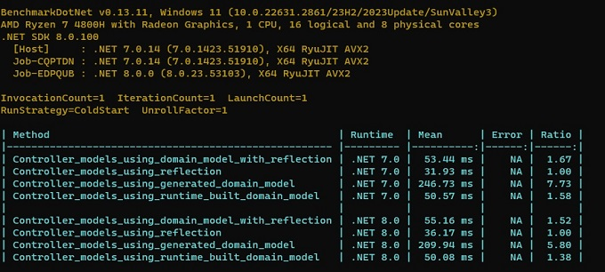
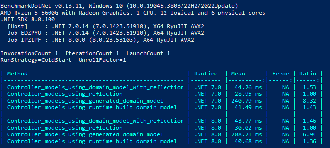
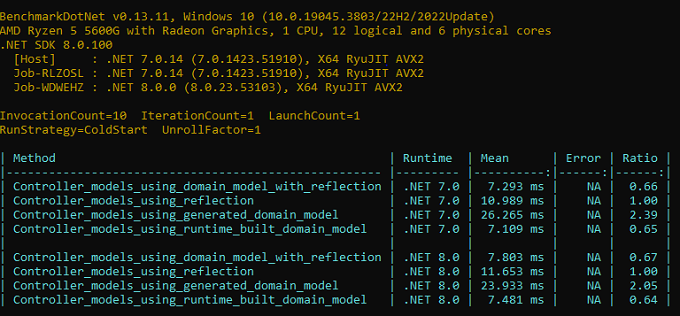

# DomainModel Over Reflection

The aim of this research is find whether generating a domain model class which
with source generators has can reduce startup time of an application compared
to using runtime reflection to build an api model for controller generation.

## Setup

#### DomainModelOverReflection.Domain

This project contains `T4` templates for generating entities or services of a 
sample business domain of a backend service application along with 
`IDomainModel` implementations which are build using reflection at runtime

#### DomainModelOverReflection.Generator

This project generates ab `IDomainModel` implementation from the business
domain using `.Net Source Generators`
  
#### DomainModelOverReflection.Models

This project serves as a library which contains `DomainModel` and `ApiModel`
dtos and helper methods

#### DomainModelOverReflection.Test

An `NUnit` test project to validate using a generated domain model or using
reflection produces same `ApiModel`

#### DomainModelOverReflection

This console application uses `BenchmarkDotNet` library to run benchmark tests

## Benchmark Setup

The benchmark tests are run using following specifications;

- Benchmark tests are run both using `.net7.0` and `.net8.0`
- Business domain contains
  - 1x entities with 5 public methods, 5 internal methods
  - 1x query classes with 1 readonly field, 5 public methods, 5 internal methods
  - 5x operation objects having a `With` and `Process` methods

## Results

The following results displays performance of each approach with different 
hardware specifications. Domain is configured to have 200 entites with
relative amount of query and operation objects classes.

First benchmarks are run with `RunStrategy.ColdStart` and single invocation
and iteration to simulate application startup process.

Second benchmarks are run with `RunStrategy.ColdStart` and 10 invocations
and 10 iterations.

## Conclusion

Using a pregenerated domain model has a significant amount of JIT overhead
at startup and the ratio increases as more business entites or members are
added. When multiple invocations are performed, even though ratios are much 
closer, generated domain model still falls behind when compared to generating 
domain model at runtime.

